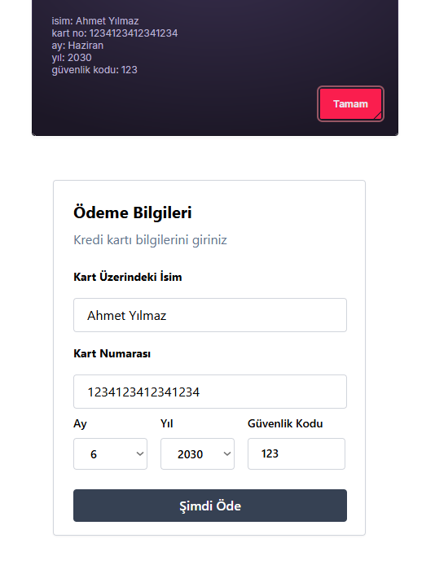

# React + TailwindCSS ile Kredi Kartı Ödeme Formu

Bu proje, **React** ve **TailwindCSS** kullanılarak hazırlanmış basit bir kredi kartı ödeme formunu içerir.  

Formda kullanıcıdan şu bilgiler alınmaktadır:

- Kart Üzerindeki İsim
- Kart Numarası
- Ay
- Yıl
- Güvenlik Kodu

## 📸 Ekran Görüntüsü




##  Özellikler

- Modern ve responsive tasarım  
- TailwindCSS ile kolay özelleştirme  
- Placeholder’lar ve input alanları ile kullanıcı dostu arayüz 

## 📁 Klasör Yapısı

```
proje-adi/
├── public/
├── src/
│   ├── assets/
│   ├── App.tsx
│   ├── index.css
│   ├── main.tsx
│   └── vite-env.d.ts
├── .gitignore
├── eslint.config.js
├── index.html
├── package.json
├── package-lock.json
├── README.md
├── tsconfig.json
├── tsconfig.app.json
├── tsconfig.node.json
└── vite.config.ts
```

## 🛠 Teknolojiler

- ⚛️ React
- ⚡ Vite
- 🎨 Tailwind CSS
- 🧹 ESLint
- 🟦 TypeScript

## 🧪 Gereksinimler

- Node.js 18+
- npm (veya yarn)


## 🌐 GitHub

[Proje GitHub Sayfası](https://github.com/ozcanzaferayan/react)

## 📄 Lisans

MIT Lisansı ile lisanslanmıştır. Özgürce kullanabilir, düzenleyebilir ve paylaşabilirsiniz.

---

